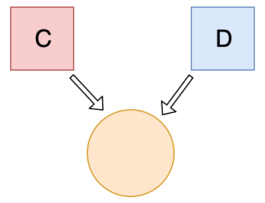
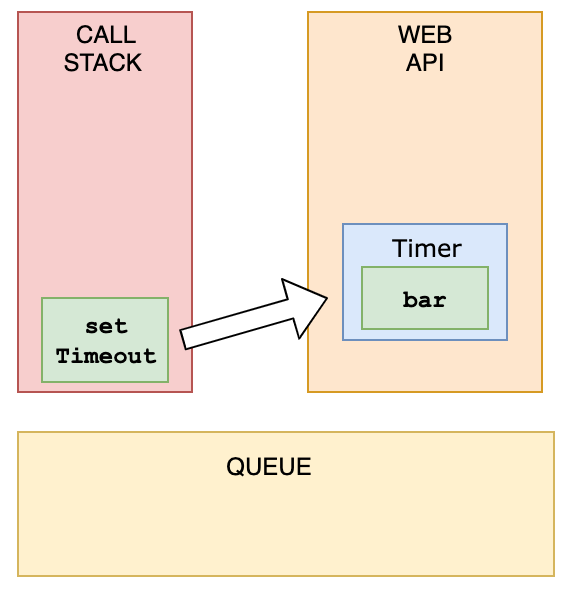
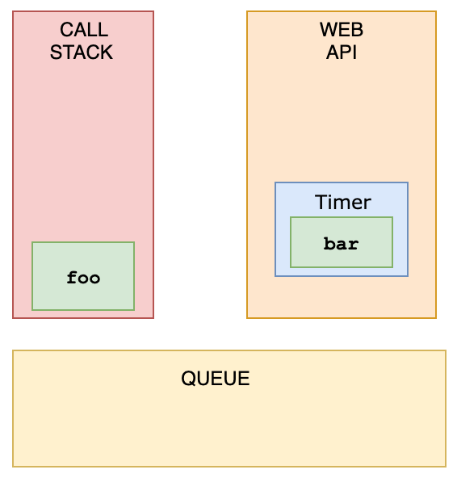
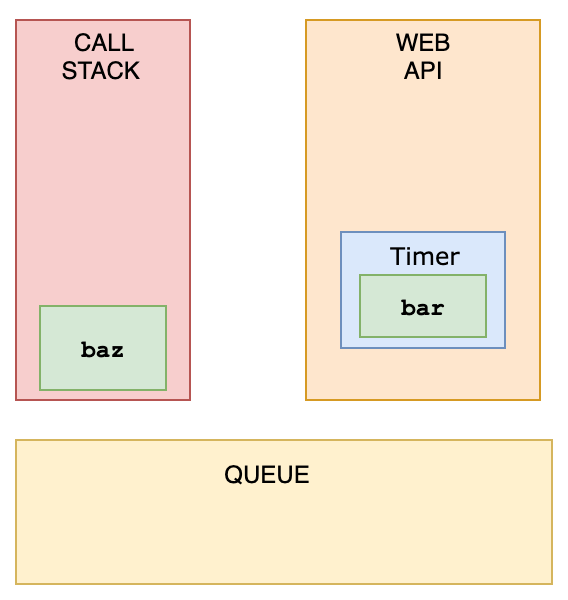
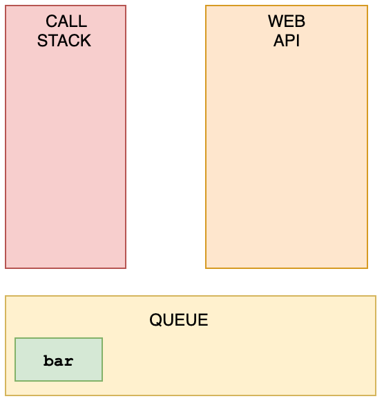
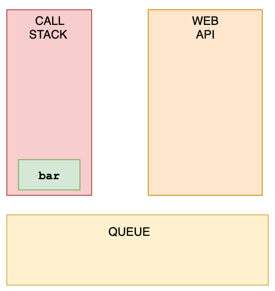

## 1. What's the output?

**答案: D**

在函数内部，我们首先通过 `var` 关键字声明了 `name` 变量。这意味着变量被提升了（内存空间在创建阶段就被设置好了），直到程序运行到定义变量位置之前默认值都是 `undefined`。因为当我们打印 `name` 变量时还没有执行到定义变量的位置，因此变量的值保持为 `undefined`。

通过 `let` 和 `const` 关键字声明的变量也会提升，但是和 `var` 不同，它们不会被*初始化*。在我们声明（初始化）之前是不能访问它们的。这个行为被称之为暂时性死区。当我们试图在声明之前访问它们时，JavaScript 将会抛出一个 `ReferenceError` 错误。

## 2. What's the output?

**答案: C**

由于 JavaScript 的事件循环，`setTimeout` 回调会在*遍历结束后*才执行。因为在第一个遍历中遍历 `i` 是通过 `var` 关键字声明的，所以这个值是全局作用域下的。在遍历过程中，我们通过一元操作符 `++` 来每次递增 `i` 的值。当 `setTimeout` 回调执行的时候，`i` 的值等于 3。

在第二个遍历中，遍历 `i` 是通过 `let` 关键字声明的：通过 `let` 和 `const` 关键字声明的变量是拥有块级作用域（指的是任何在 {} 中的内容）。在每次的遍历过程中，`i` 都有一个新值，并且每个值都在循环内的作用域中。

## 3. What's the output?

**答案: B**

注意 `diameter` 的值是一个常规函数，但是 `perimeter` 的值是一个箭头函数。

对于箭头函数，`this` 关键字指向的是它当前周围作用域（简单来说是包含箭头函数的常规函数，如果没有常规函数的话就是全局对象），这个行为和常规函数不同。这意味着当我们调用 `perimeter` 时，`this` 不是指向 `shape` 对象，而是它的周围作用域（在例子中是 `window`）。

在 `window` 中没有 `radius` 这个属性，因此返回 `undefined`。

## 4. What's the output?

**答案: A**

一元操作符加号尝试将 bool 转为 number。`true` 转换为 number 的话为 `1`，`false` 为 `0`。

字符串 `'Lydia'` 是一个真值，真值取反那么就返回 `false`。

## 5. Which one is true?

**答案: A**

在 JavaScript 中，所有对象的 keys 都是字符串（除非对象是 Symbol）。尽管我们可能不会定义它们为字符串，但它们在底层总会被转换为字符串。

当我们使用括号语法时（[]），JavaScript 会解释（或者 unboxes）语句。它首先看到第一个开始括号 `[` 并继续前进直到找到结束括号 `]`。只有这样，它才会计算语句的值。

`mouse[bird.size]`：首先计算 `bird.size`，这会得到 `small`。`mouse["small"]` 返回 `true`。

然后使用点语法的话，上面这一切都不会发生。`mouse` 没有 `bird` 这个 key，这也就意味着 `mouse.bird` 是 `undefined`。然后当我们使用点语法 `mouse.bird.size` 时，因为 `mouse.bird` 是 `undefined`，这也就变成了 `undefined.size`。这个行为是无效的，并且会抛出一个错误类似 `Cannot read property "size" of undefined`。

## 6. What's the output?

**答案: A**

在 JavaScript 中，当设置两个对象彼此相等时，它们会通过*引用*进行交互。

首先，变量 `c` 的值是一个对象。接下来，我们给 `d` 分配了一个和 `c` 对象相同的引用。



因此当我们改变其中一个对象时，其实是改变了所有的对象。

## 7. What's the output?

**答案: C**

`new Number()` 是一个内建的函数构造器。虽然它看着像是一个 number，但它实际上并不是一个真实的 number：它有一堆额外的功能并且它是一个对象。

当我们使用 `==` 操作符时，它只会检查两者是否拥有相同的*值*。因为它们的值都是 `3`，因此返回 `true`。

然后，当我们使用 `===` 操作符时，两者的值以及*类型*都应该是相同的。`new Number()` 是一个对象而不是 number，因此返回 `false`。

## 8. What's the output?

**答案: D**

`colorChange` 是一个静态方法。静态方法被设计为只能被创建它们的构造器使用（也就是 `Chameleon`），并且不能传递给实例。因为 `freddie` 是一个实例，静态方法不能被实例使用，因此抛出了 `TypeError` 错误。

## 9. What's the output?

**答案: A**

代码打印出了一个对象，这是因为我们在全局对象上创建了一个空对象！当我们将 `greeting` 写错成 `greetign` 时，JS 解释器实际在上浏览器中将它视为 `global.greetign = {}` （或者 `window.greetign = {}`）。

为了避免这个为题，我们可以使用 `"use strict"。这能确保当你声明变量时必须赋值。

## 10. What happens when we do this?

**答案: A**

这在 JavaScript 中是可以的，因为函数是对象！（除了基本类型之外其他都是对象）

函数是一个特殊的对象。你写的这个代码其实不是一个实际的函数。函数是一个拥有属性的对象，并且属性也可被调用。

## 11. What's the output?

**答案: A**

你不能像常规对象那样，给构造函数添加属性。如果你想一次性给所有实例添加特性，你应该使用原型。因此本例中，使用如下方式：

```js
Person.prototype.getFullName = function() {
  return `${this.firstName} ${this.lastName}`;
};
```

这才会使 `member.getFullName()` 起作用。为什么这么做有益的？假设我们将这个方法添加到构造函数本身里。也许不是每个 `Person` 实例都需要这个方法。这将浪费大量内存空间，因为它们仍然具有该属性，这将占用每个实例的内存空间。相反，如果我们只将它添加到原型中，那么它只存在于内存中的一个位置，但是所有实例都可以访问它！

## 12. What's the output?

**答案: A**

对于 `sarah`，我们没有使用 `new` 关键字。当使用 `new` 时，`this` 引用我们创建的空对象。当未使用 `new` 时，`this` 引用的是**全局对象**（global object）。

我们说 `this.firstName` 等于 `"Sarah"`，并且 `this.lastName` 等于 `"Smith"`。实际上我们做的是，定义了 `global.firstName = 'Sarah'` 和 `global.lastName = 'Smith'`。而 `sarah` 本身是 `undefined`。

## 13. What are the three phases of event propagation?

**答案: D**

在**捕获**（capturing）阶段中，事件从祖先元素向下传播到目标元素。当事件达到**目标**（target）元素后，**冒泡**（bubbling）才开始。


## 14. All object have prototypes.

**答案: B**

除了**基本对象**（base object），所有对象都有原型。基本对象可以访问一些方法和属性，比如 `.tostring`。这就是为什么你可以使用内置的 JavaScript 方法！所有这些方法在原型上都是可用的。虽然 JavaScript 不能直接在对象上找到这些方法，但 JavaScript 会沿着原型链找到它们，以便于你使用。

## 15. What's the output?

**答案: C**

JavaScript 是一种**动态类型语言**：我们不指定某些变量的类型。值可以在你不知道的情况下自动转换成另一种类型，这种类型称为**隐式类型转换**（implicit type coercion）。**Coercion** 是指将一种类型转换为另一种类型。

在本例中，JavaScript 将数字 `1` 转换为字符串，以便函数有意义并返回一个值。在数字类型（`1`）和字符串类型（`'2'`）相加时，该数字被视为字符串。我们可以连接字符串，比如 `"Hello" + "World"`，这里发生的是 `"1" + "2"`，它返回 `"12"`。

## 16. What's the output?

**答案: C**

一元**后自增**运算符 `++`：

1. 返回值（返回 `0`）
2. 值自增（number 现在是 `1`）

一元**前自增**运算符 `++`：

1. 值自增（number 现在是 `2`）
2. 返回值（返回 `2`）

结果是 `0 2 2`.

## 17. What's the output?

**答案: B**

如果使用标记模板字面量，第一个参数的值总是包含字符串的数组。其余的参数获取的是传递的表达式的值！

## 18. What's the output?

**答案: C**

在测试相等性时，基本类型通过它们的值（value）进行比较，而对象通过它们的引用（reference）进行比较。JavaScript 检查对象是否具有对内存中相同位置的引用。

题目中我们正在比较的两个对象不是同一个引用：作为参数传递的对象引用的内存位置，与用于判断相等的对象所引用的内存位置并不同。

这也是 `{ age: 18 } === { age: 18 }` 和 `{ age: 18 } == { age: 18 }` 都返回 `false` 的原因。

## 19. What's the output?

**答案: C**

扩展运算符（`...args`）会返回实参组成的数组。而数组是对象，因此 `typeof args` 返回 `"object"`。

## 20. What's the output?

**答案: C**

使用 `"use strict"`，你可以确保不会意外地声明全局变量。我们从来没有声明变量 `age`，因为我们使用 `"use strict"`，它将抛出一个引用错误。如果我们不使用 `"use strict"`，它就会工作，因为属性 `age` 会被添加到全局对象中了。

## 21. What's value of `sum`?

**答案: A**

代码以字符串形式传递进来，`eval` 对其求值。如果它是一个表达式，就像本例中那样，它对表达式求值。表达式是 `10 * 10 + 5`。这将返回数字 `105`。

## 22. How long is cool_secret accessible?

**答案: B**

关闭 **tab 标签页** 后，`sessionStorage` 存储的数据才会删除。

如果使用 `localStorage`，那么数据将永远在那里，除非调用了 `localStorage.clear()`。

## 23. What's the output?

**答案: B**

使用 `var` 关键字，你可以用相同的名称声明多个变量。然后变量将保存最新的值。

你不能使用 `let` 或 `const` 来实现这一点，因为它们是块作用域的。

## 24. What's the output?

**答案: C**

所有对象的键（不包括 Symbol）在底层都是字符串，即使你自己没有将其作为字符串输入。这就是为什么 `obj.hasOwnProperty('1')` 也返回 `true`。

对于集合，它不是这样工作的。在我们的集合中没有 `'1'`：`set.has('1')` 返回 `false`。它有数字类型为 `1`，`set.has(1)` 返回 `true`。

## 25. What's the output?

**答案: C**

如果你有两个名称相同的键，则键会被替换掉。它仍然位于第一个键出现的位置，但是值是最后出现那个键的值。

## 26. The JavaScript global execution context creates two things for you: the global object, and the "this" keyword.

**答案: A**

基本执行上下文是全局执行上下文：它是代码中随处可访问的内容。

## 27. What's the output?

**答案: C**

如果某个条件返回 `true`，则 `continue` 语句跳过本次迭代。

## 28. What's the output?

**答案: A**

`String` 是内置的构造函数，我们可以向它添加属性。我只是在它的原型中添加了一个方法。基本类型字符串被自动转换为字符串对象，由字符串原型函数生成。因此，所有 string(string 对象)都可以访问该方法！

## 29. What's the output?

**答案: B**

对象的键被自动转换为字符串。我们试图将一个对象 `b` 设置为对象 `a` 的键，且相应的值为 `123`。

然而，当字符串化一个对象时，它会变成 `"[object Object]"`。因此这里说的是，`a["[object Object]"] = 123`。然后，我们再一次做了同样的事情，`c` 是另外一个对象，这里也有隐式字符串化，于是，`a["[object Object]"] = 456`。

然后，我们打印 `a[b]`，也就是 `a["[object Object]"]`。之前刚设置为 `456`，因此返回的是 `456`。

## 30. What's the output?

**答案: B**

我们有一个 `setTimeout` 函数，并首先调用它。然而，它是最后打印日志的。

这是因为在浏览器中，我们不仅有运行时引擎，还有一个叫做 `WebAPI` 的东西。`WebAPI` 提供了 `setTimeout` 函数，也包含其他的，例如 DOM。

将 _callback_ 推送到 WebAPI 后，`setTimeout` 函数本身(但不是回调！)将从栈中弹出。



现在，`foo` 被调用，打印 `"First"`。



`foo` 从栈中弹出，`baz` 被调用. 打印 `"Third"`。



WebAPI 不能随时向栈内添加内容。相反，它将回调函数推到名为 _queue_ 的地方。



这就是事件循环开始工作的地方。一个**事件循环**查看栈和任务队列。如果栈是空的，它接受队列上的第一个元素并将其推入栈。



`bar` 被调用，打印 `"Second"`，然后它被栈弹出。
